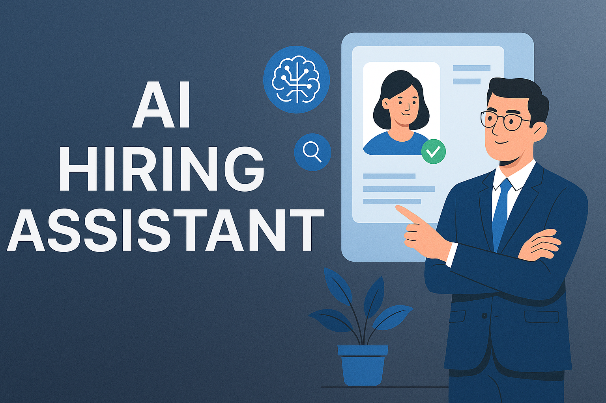

Deployed Site Link 🔗: https://predictive-hiring-ai.streamlit.app/

# 🤖 Predictive Hiring with AI

An intelligent, Streamlit-based web app that predicts a candidate's **hiring potential** using Machine Learning. It simplifies recruitment workflows with tools like **ATS-friendliness checks**, **resume analysis**, and **chatbot-guided user interaction**.

---



---

## 🚀 Features

- ✅ **ML-based Hiring Suitability Prediction**
- 🧠 Integrated **Scikit-learn Model**
- 📄 **Resume Upload & ATS Friendliness Analyzer**
- 💬 **OpenAI-powered Chatbot** for interview guidance
- 👤 **User Authentication & History Logs** via Supabase
- ⚡ **Fast, Responsive UI** built with Streamlit
- ☁️ **Supabase DB** for real-time user & activity tracking

---

## 🛠️ Tech Stack
```bash

| Layer         | Technologies Used                           |
|---------------|---------------------------------------------|
| 💻 Frontend    | Streamlit, HTML/CSS                        |
| 🧠 Backend     | Python, FastAPI (optional)                 |
| 📊 ML Model    | Scikit-learn, Pandas                       |
| 🗃️ Database    | Supabase (PostgreSQL)                      |
| 🔐 Auth        | Supabase Auth + RLS                        |
| 🌍 Hosting     | GitHub + Streamlit Cloud                   |
```
---

## 📁 Project Structure

```bash
predictive-hiring-app/
├── requirements.txt
├── backend/
│   ├── model/
│   │   ├── predictive_model.pkl
│   │   └── train_model.py
│   └── dataset/
│       └── hiring_data.csv
├── frontend/
│   ├── app_ui_only.py
│   ├── hiring_assistant.py
│   ├── .streamlit/
│   │   └── secrets.toml
│   └── assets/
│       └── banner.png
```

## 👩‍💻 Local Setup##
```bash
1. **Clone the Repo**
   ```bash
   git clone https://github.com/Krithiikaa/Predictive-Hiring-with-AI.git
   cd predictive-hiring-app
````

2. **Create Virtual Environment**

   ```bash
   python -m venv venv
   venv\Scripts\activate   # On Windows
   ```

3. **Install Requirements**

   ```bash
   pip install -r requirements.txt
   ```

4. **Create a `.env` File** in root with:

   ```
   SUPABASE_URL=your_supabase_url
   SUPABASE_KEY=your_supabase_anon_key
   COHERA_KEY=your_cohera_api_key
   ```

5. **Run the App**

   ```bash
   streamlit run app_ui_only.py
   ```

---

🎯 How It Works

➣ User submits the candidate details via a form.

➣ The trained ML model predicts whether the candidate is suitable (Hired or Not Hired).

➣ The result page shows:

   ➣ Prediction result
   
   ➣ Personalized suggestions for improvement
   
   ➣ Feature importance graph
   
➣ Admin can log in to:
   
   ➣ View historical predictions
   
   ➣ Analyze hiring trends via graphs

🧠 Machine Learning Model

➢ Trained using scikit-learn based on features like experience, interview score, certifications, etc.

➢ Saved as predictive_model.pkl in the backend/model/ folder.

➢ Re-trainable via train_model.py.

💬 Chatbot Assistant (Optional Feature)

✮ Integrated support chatbot available in Hiring_assistant.py.

✮ Can answer predefined HR queries or interact via API (OpenAI or local).

🔒 Authentication

➤ Login page available for both Admin and User

➤ Credentials stored in users.csv

➤ Access-based redirection to:

   ➤ Prediction Form (User)
   
   ➤ Admin Dashboard (Admin)


## 🌐 Deployment Instructions (Streamlit Cloud)

1. Push your code to GitHub
2. Go to [Streamlit Cloud](https://streamlit.io/cloud)
3. Connect your GitHub repo
4. Add environment variables (`.env`) in the Secrets section
5. Deploy and share your link!

---


## 👥 Project Team
```bash

| Name              | Register Number     | Role                                          | Email                         |
|-------------------|---------------------|-----------------------------------------------|------------------------------ |
| Kiruthigaa K      | 513423104010        | Project Lead, Developer – ATS & ChatBot       | krithikaarajkumaar@gmail.com  |
| Pooja M           | 513423104036        | Project Co-Ord, Developer – Frontend, Backend | 2308poojamurugan@gmail.com    |
| Pavithra B        | 513423104034        | Assistant Chatbot Developer                   | pavi23125@gmail.com           |
| Archana M         | 513423104054        | Assistant Frontend Developer                  | aarchana93085@gmail.com       |
| Amirthavarshini P | 513423104049        | Documentation of Application                  | amrithavarshini2466@gmail.com |
| Suruthiga R       | 513423104701        | Content Writer                                | suruthigha2207@gmail.com      |

```


---

## 📄 License

This project is licensed under the **MIT License** - see the [LICENSE](LICENSE) file for details.

---

## 🙌 Acknowledgements

* [Streamlit](https://streamlit.io/)
* [Supabase](https://supabase.com/)
* [OpenAI](https://openai.com/)
* [Scikit-learn](https://scikit-learn.org/)


